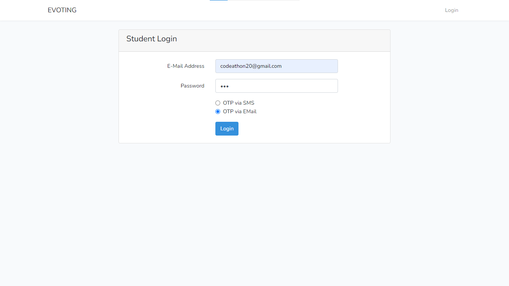
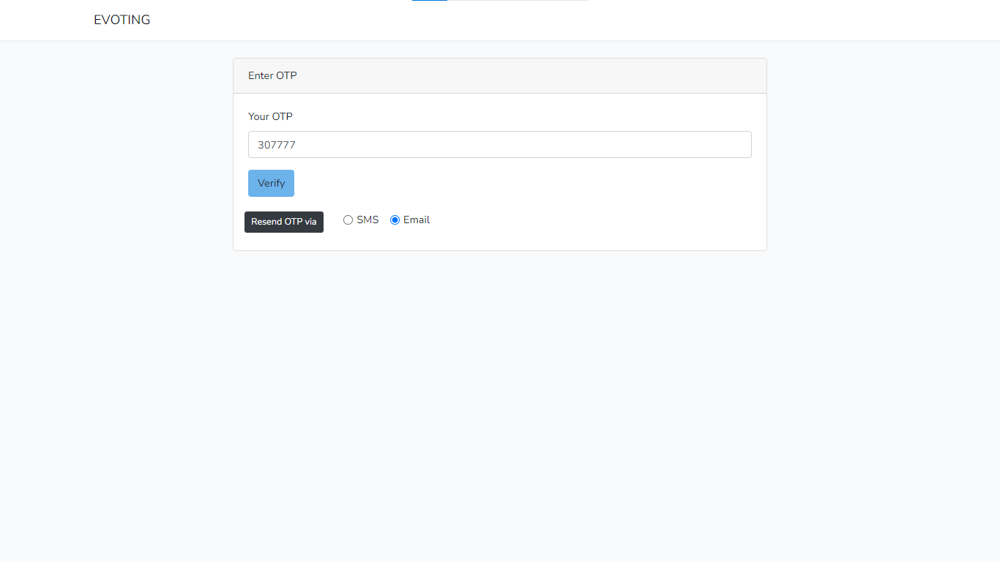
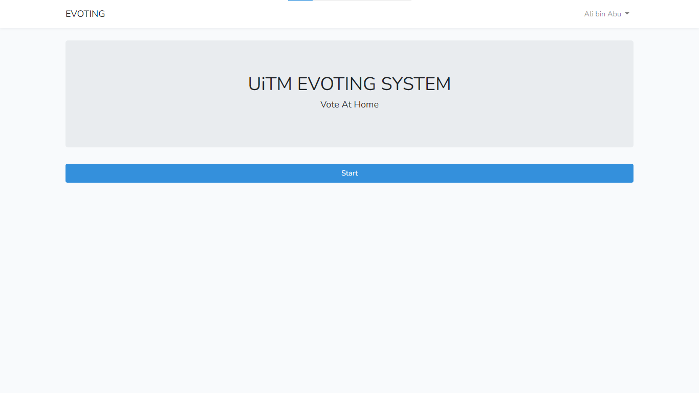
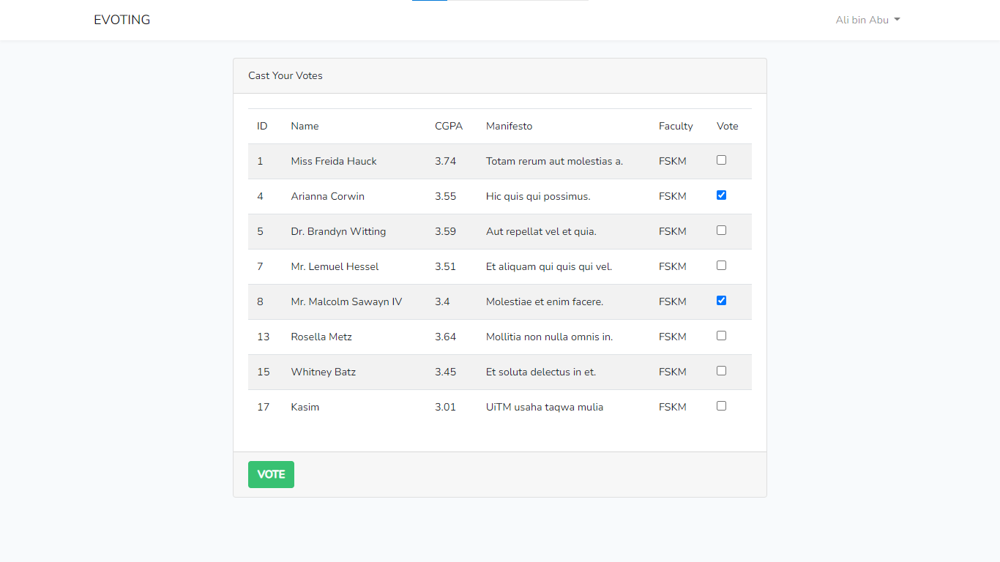

# E-Voting

Every year, UiTM Jasin will conduct an election to choose who are going to be the next Student Council. Unfortunately, due to the pandemic, universities were not allowed to do elections since it will increase the likehood of Covid-19 infection. Thus, E-Voting System was developed. It is a web app that allows UiTM students to vote online at home during Covid-19 pandemic.

>This project is submitted for Code-A-Thon competition organized by Netcentric Club of UiTM.
This project managed to get gold medal in the competition.

## Features

- Upon login, student will receive OTP (one-time password) for security purposes.
- Implements faker library to seed the database with 300 students.
- Admin can use "Generate votes" function that will generate random votes, to simulate votes from 300 students.
- Admin can see chart that shows the top 4 candidates with the highest votes. Those top 4 candidates will be appointed the role as president, vice-president, secretary & treasurer respectively.

## Screenshots

Student's login page. Student can receive their OTP through email or SMS upon login.

Enter OTP page

Home page

Student can vote 2 of their desired candidates.

Admin can see the top 4 candidates with the highest votes.

## Tech Stack

This project is made using Laravel 5.7, Bootstrap 4 and MySQL database.
